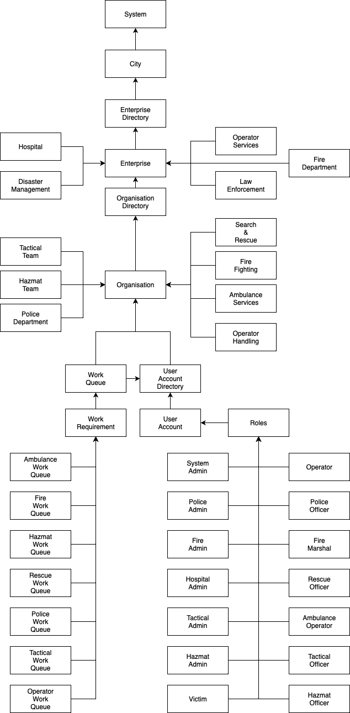
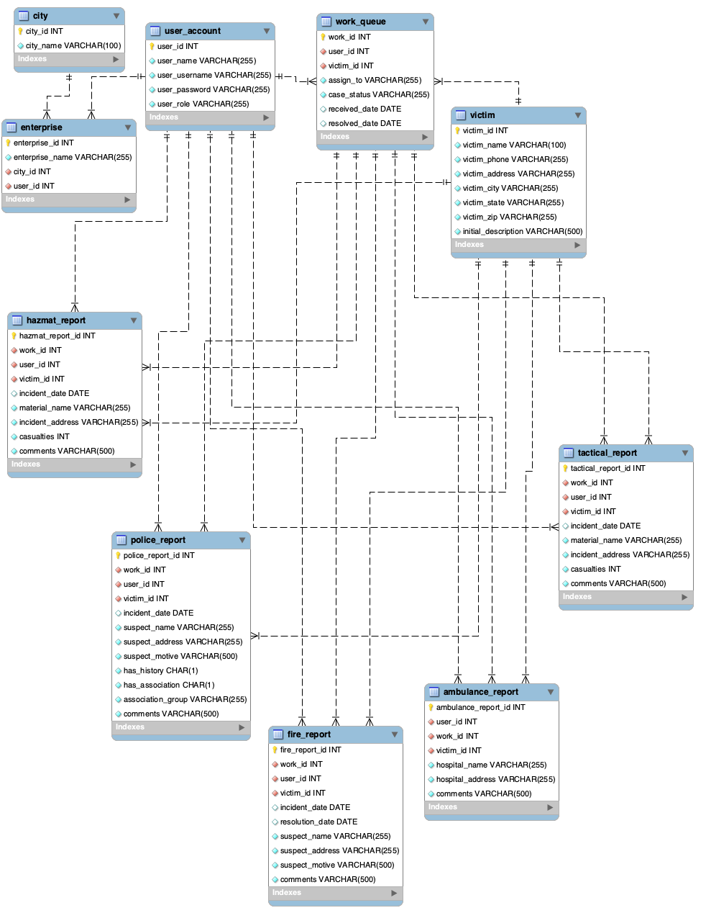
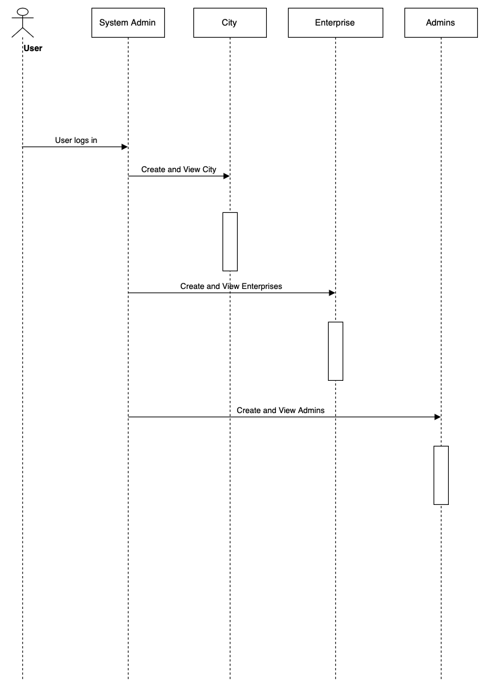
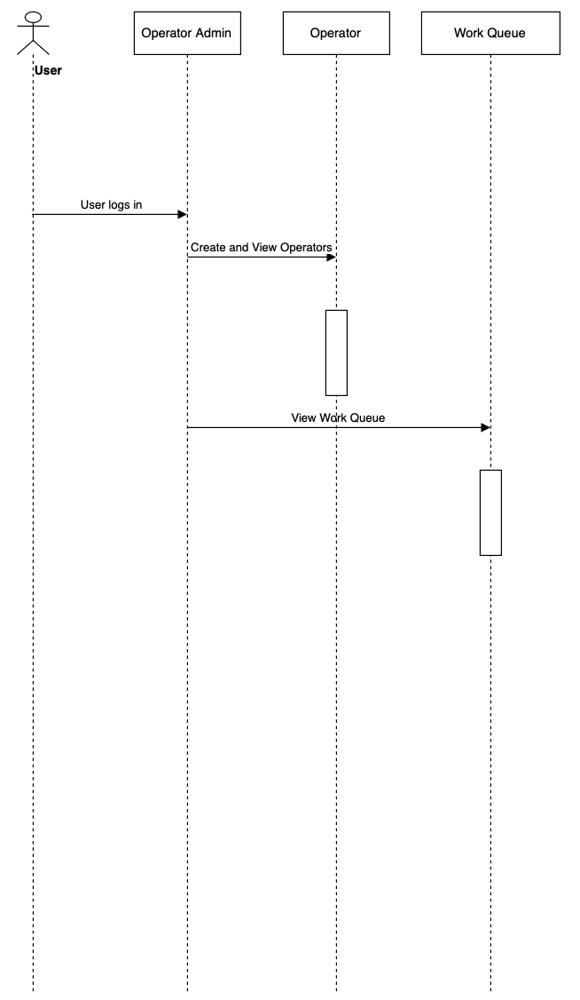
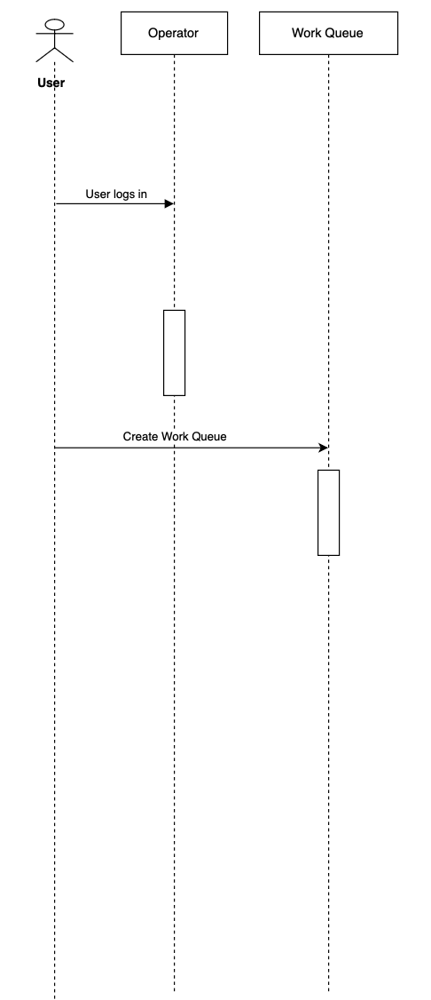
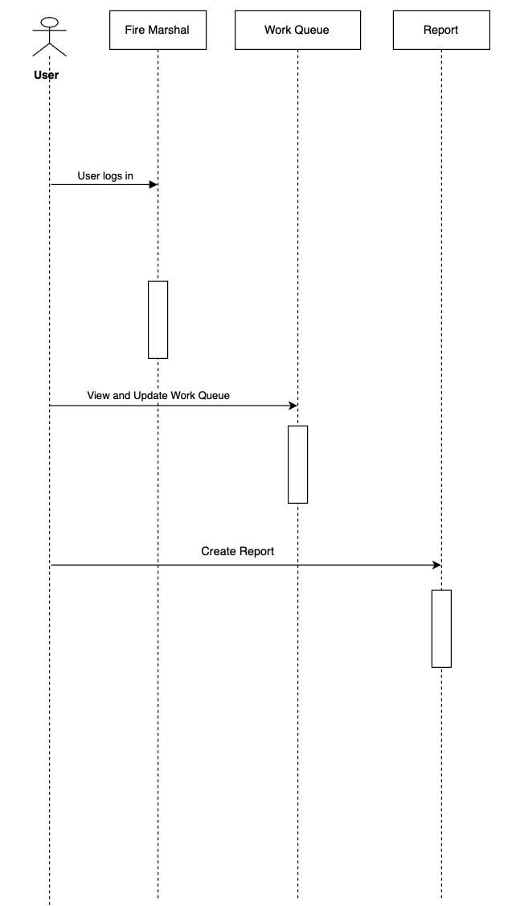
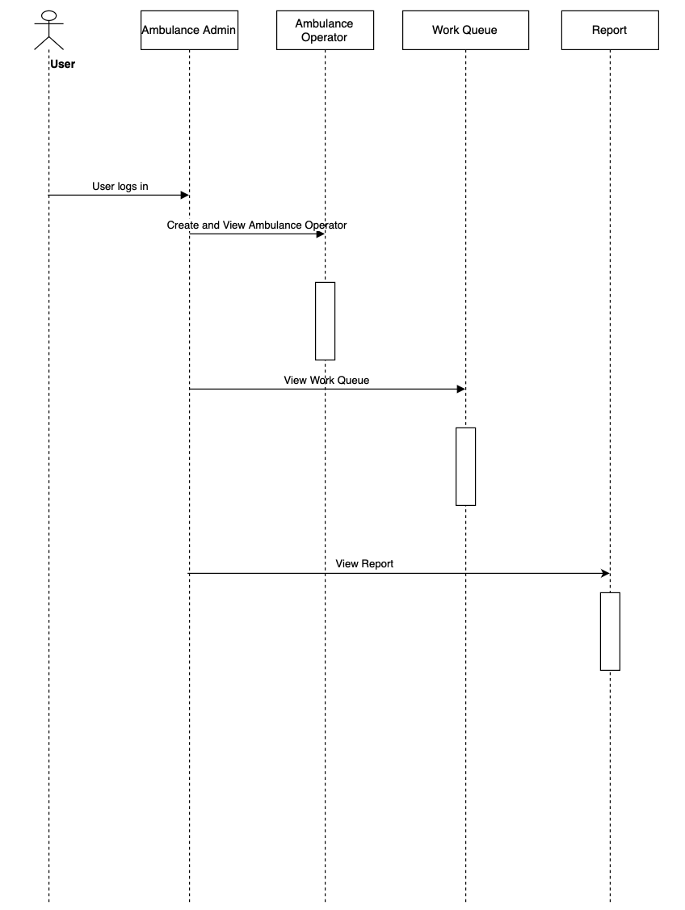
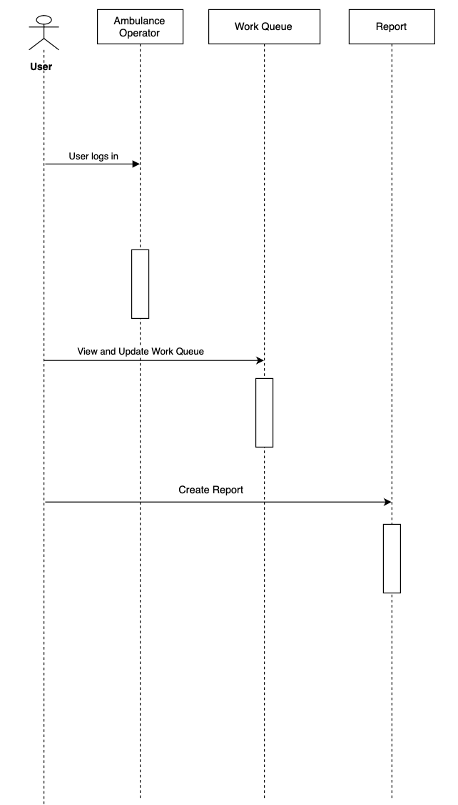
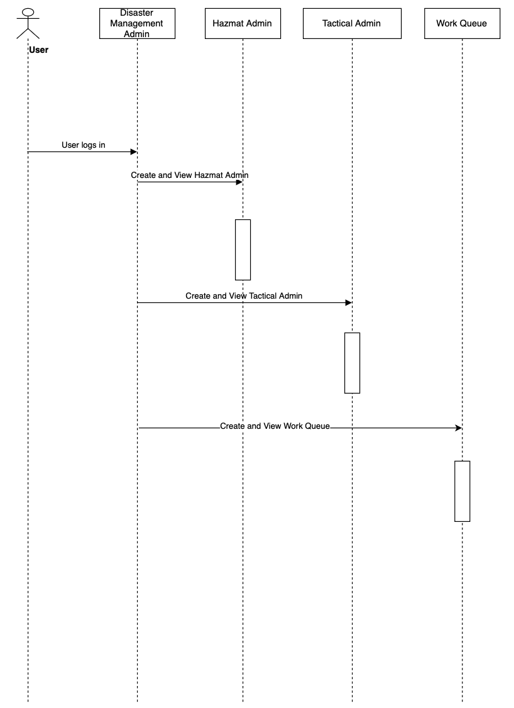
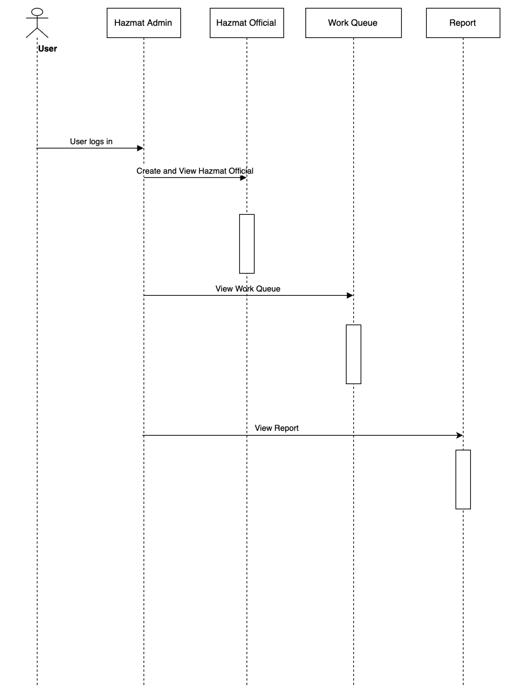

__Emergency Services Management__

For every city, there should be a proper reporting system for emergencies so that victims can be attended to in time, and the emergency is swiftly resolved.

The purpose of Emergency Services Management is to record the incoming emergencies, important details of the incident and victim. And to assign these incidents to the proper authorities, so that they can act swiftly to assign case to required personnel and resolve the incident.

This system has a database which stores the data for incidents and the victims so that they can be looked upon for creating reports.

 
Diagrams:-
 

__1. Object Model Diagram:-__  

__2. ER Diagram:-__

__3. System Admin Sequence Diagram:-__

__4. Operator Admin Sequence Diagram:-__

__5. Operator Sequence Diagram:-__

__6. Fire Admin Sequence Diagram:-__

__7. Fire Marshal Sequence Diagram:-__

__8. Police Admin Sequence Diagram:-__

__9. Police Officer Sequence Diagram:-__

__10. Ambulance Admin Sequence Diagram:-__

__11. Ambulance Operator Sequence Diagram:-__

__12. Disaster Management Admin Sequence Diagram:-__

__13. Hazmat Admin Sequence Diagram:-__

__14. Hazmat Official Sequence Diagram:-__

__15. Tactical Admin Sequence Diagram:-__

__16. Tactical Official Sequence Diagram:-__

